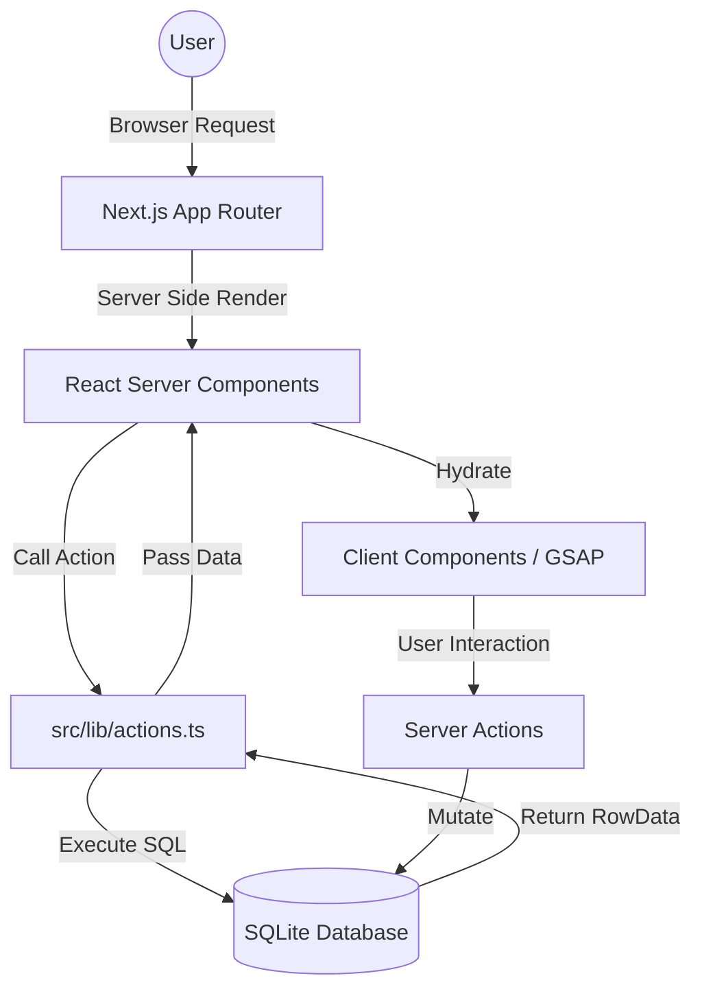

# Bibliotheca Modern - Comprehensive Documentation

## 1. Project Overview
Bibliotheca Modern is a premium, modernized digital bookstore experience. It transcends traditional e-commerce by blending high-end editorial design with cutting-edge web technologies. The platform is designed to provide users with an immersive, fluid, and aesthetic environment for discovering and purchasing literary works.

---

## 2. Design Layout & Documents
### 2.1 Visual Philosophy
- **Modern Minimalist / Editorial**: Inspired by high-end fashion and art magazines. Large typography, ample whitespace, and high-contrast color schemes.
- **Atmospheric Dark Mode**: The primary palette is built on deep navy/slate backgrounds (`#0a191f`) with vibrant cyan and white accents to guide user attention.
- **Fluid Motion**: Every interaction is designed to feel "living" through the use of GSAP and Framer Motion.

### 2.2 Core Layouts
- **Home Page**: Features a "Stage-style" Hero Carousel with staggered text animations, a curated "Featured Books" grid (3x2), and a philosophical "Quote Section" to establish brand identity.
- **Shop Catalog**: A clean 3-column grid layout with a functional sidebar for filtering. It uses "Soft-Loading" patterns where book covers are presented as high-quality objects.
- **Book Details**: An immersive view focusing on typography and the physical presence of the book (large synopsis, author bio, and related selections).
- **User Profile**: A dashboard-style layout tracking reading progress, streaks, and library statistics.

---

## 3. Tech Stack
| Layer | Technology |
|---|---|
| **Framework** | Next.js 15+ (App Router) |
| **Language** | TypeScript |
| **Styling** | Tailwind CSS 4.0 |
| **Animations** | GSAP (GreenSock), Framer Motion |
| **Icons** | Lucide React |
| **Database** | SQLite (Better-SQLite3) |
| **Runtime** | Node.js |
| **Server Components** | React Server Components (RSC) for Data Fetching |

---

## 4. Technical & Creative Decisions
### 4.1 Creative Decisions
- **Serif vs. Sans-Serif**: The use of `Playfair Display` for headings (Serif) conveys authority and elegance, while `Inter` (Sans-Serif) ensures high readability for metadata.
- **Physicality in UI**: Book covers are treated with deep shadows and hover-scale effects to mimic the feeling of picking up a physical book.
- **Editorial Copy**: Buttons use active, inviting language ("Explore Archive", "Claim Copy") rather than generic e-commerce terms.

### 4.2 Technical Decisions
- **Direct Database Access in RSC**: Forfeited internal API routes in favor of direct SQLite queries within Next.js Server Actions and Components to reduce latency and improve SEO.
- **Hybrid Animation Engine**: Used GSAP for complex timeline-based animations (Hero Carousel) and Framer Motion for simple layout transitions (Navbar, Buttons) to balance performance and developer velocity.
- **WAL Mode SQLite**: Enabled Write-Ahead Logging (WAL) in `better-sqlite3` to allow concurrent reads and writes, crucial for a responsive user experience.

---

## 5. Data Flow
The application follows a **Unidirectional Data Flow** pattern leveraging Next.js's modern architecture.

1.  **Request**: User navigates to a page.
2.  **Server Fetch**: The Page (Server Component) calls a `lib/actions.ts` function.
3.  **Database Query**: `better-sqlite3` executes a query against `database.sqlite`.
4.  **Render**: Data is passed as props to Client Components (like Hero or FeaturedBooks).
5.  **Action**: User interacts (e.g., adds to cart). Cart state is updated via `CartContext` (Client-side) or recorded in DB via Server Actions.

### 5.1 Dataflow Diagram


---

## 6. Database Architecture
The database is a single-file SQLite instance optimized for high-speed local development and deployment.

### 6.1 Tables Schema
| Table | Description | Key Fields |
|---|---|---|
| **`books`** | The central repository for all products. | `id`, `title`, `price`, `carousel_image`, `is_bestseller` |
| **`book_keywords`** | Stores metadata tags for search optimization. | `book_id`, `keyword` |
| **`profiles`** | User account information and social stats. | `id`, `username`, `email`, `reading_streak` |
| **`user_library`** | Tracks user ownership and reading status. | `user_id`, `book_id`, `status` (Reading/Bought) |
| **`admin_users`** | Credentials for the administrative backend. | `username`, `hashed_password` |

---

## 7. File Structure
```text
/public/       - Static assets (High-quality covers, Custom Fonts)
/scripts/      - Utility scripts (Database seeding, Migration)
/src/app/      - Routes and Layouts (Next.js App Router)
/src/components/- Reusable UI Units (GSAP-powered animations)
/src/context/  - Client-side state (Shopping Cart)
/src/data/     - Type definitions and static mock data
/src/lib/      - Core Logic (Database config, SQL Queries)
/stitch/       - Raw design/code fragments from the "Modernization" phase
```

---
*Created by Antigravity for Bibliotheca Modern.*

