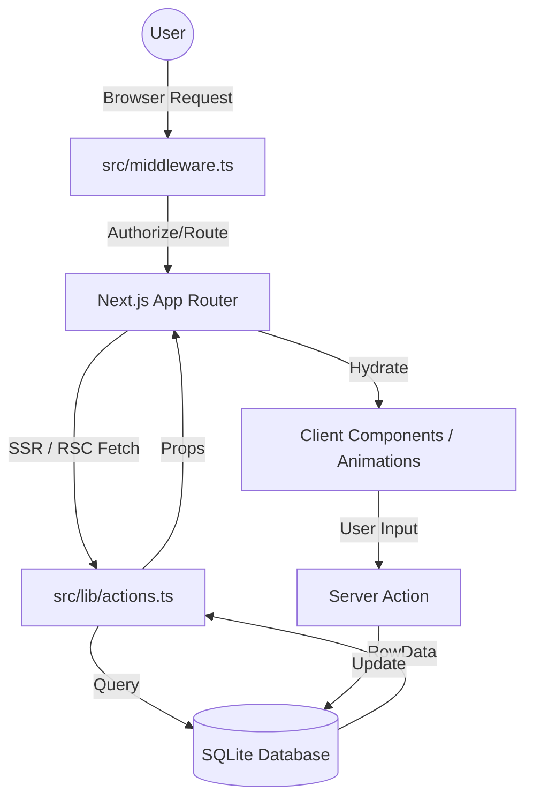

# 03 - System Architecture

## 1. Core Logic Flow
Bibliotheca Modern uses a **Server-First Architecture** for Next.js 15. The core philosophy is to fetch and process as much data as possible on the server to reduce the client-side footprint.

### 1.1 Unidirectional Data Stream

---

## 2. Component/Path Layering
- **Layer 1: Routing & Middleware**: `src/app/` and `src/middleware.ts` intercept requests and manage state.
- **Layer 2: Data Abstraction**: `src/lib/` (db, actions, auth) mediates between Next.js and SQLite.
- **Layer 3: UI Atoms**: `src/components/` stateless (mostly) UI units.
- **Layer 4: State Management**: `src/context/` only for truly interactive elements (Cart).

---

## 3. Technology Integration
- **Next.js & SQLite**: Direct connection using `better-sqlite3` within Server Components avoids the overhead of internal fetch calls or heavy ORMs.
- **WAL Mode (SQLite)**: Enabled for concurrent read-write performance, essential for a low-latency bookstore.
- **Security Logic**: Role-based access control (RBAC) enforced at the middleware level via two distinct cookie-based sessions (`auth_token` and `admin_token`).

---

## 4. Logical State Management
- **Persistent State**: User ID, Admin ID, and Library ownership (SQLite).
- **Session State**: Auth cookies (HttpOnly).
- **Ephemeral State**: Shopping Bag items (Local Storage / CartContext).
- **Navigation State**: Query parameters (`?category=...`, `?sort=...`) drive server-side filtering.

---
*Created for Bibliotheca Modern.*
